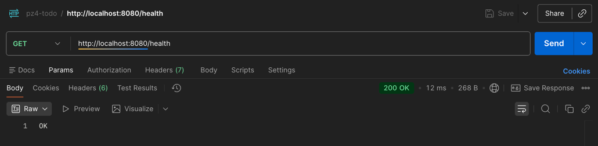
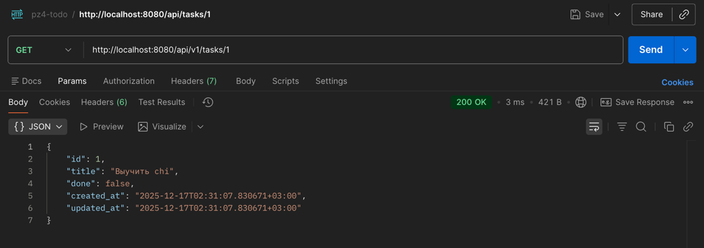
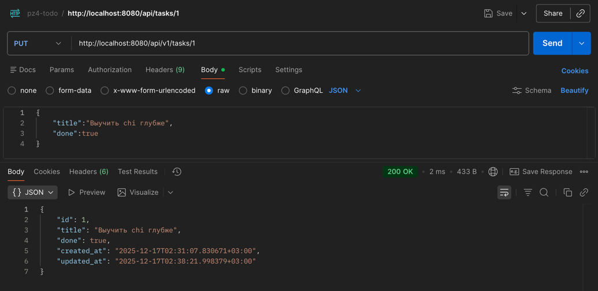
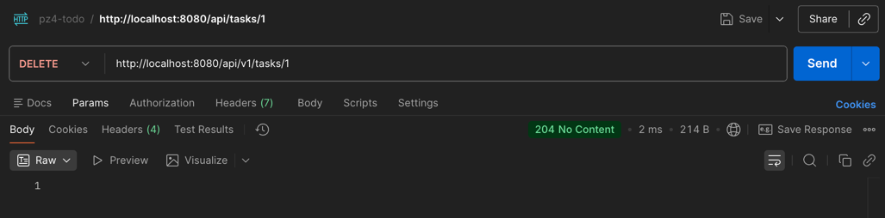
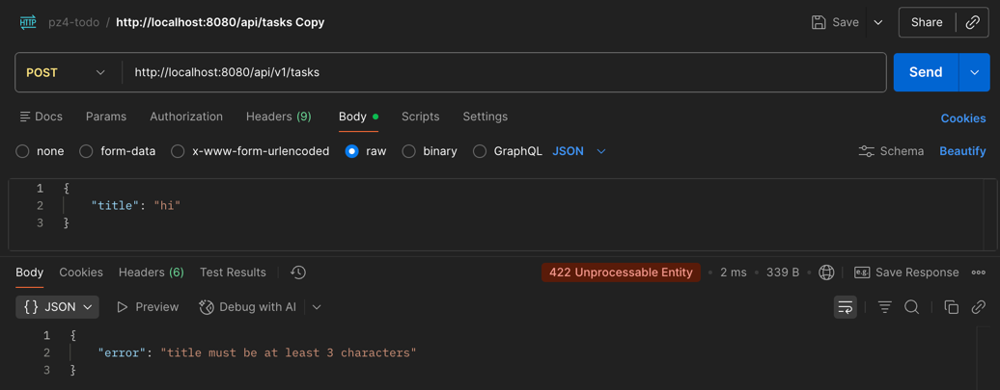
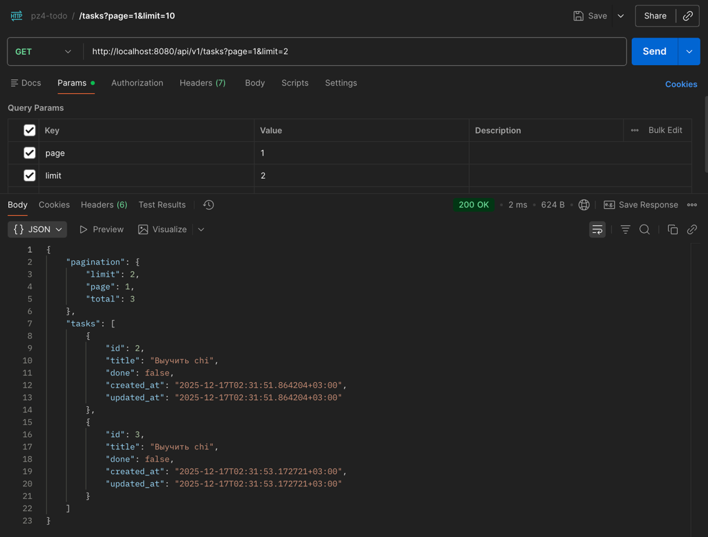
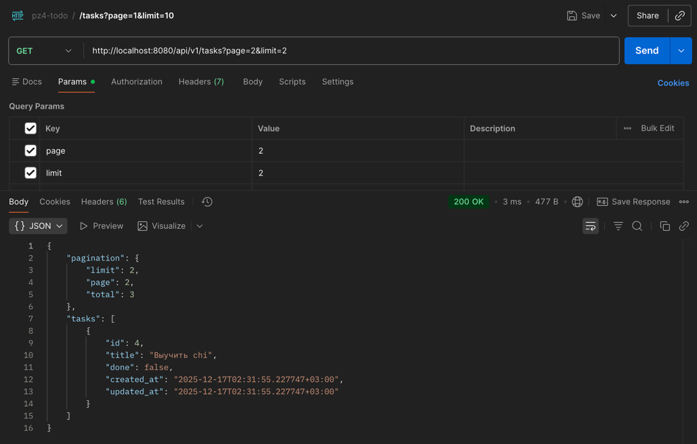
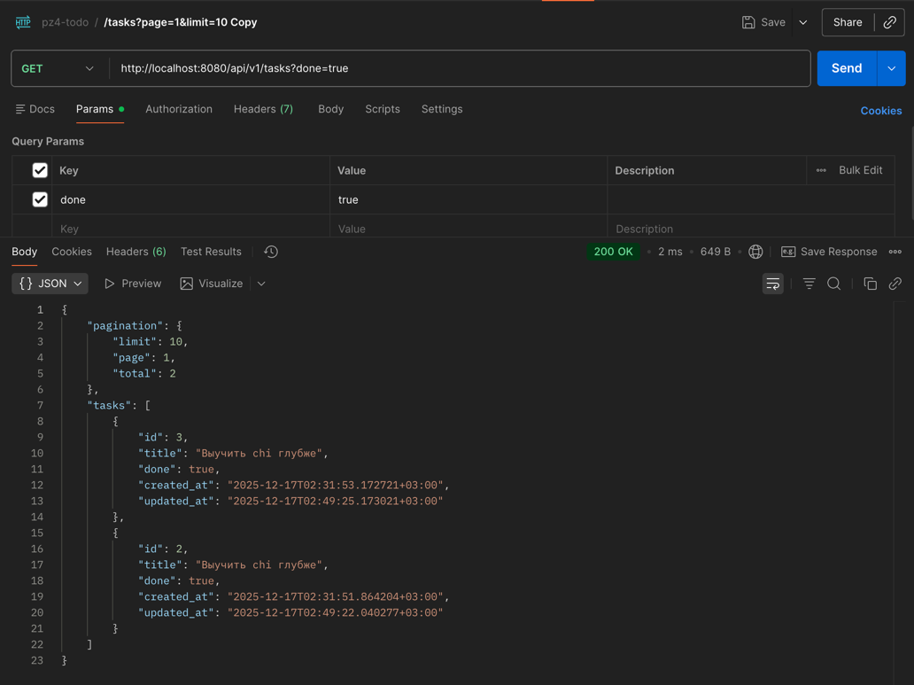

# Практическое задание №4
## Пронин Евгений Анатольевич ЭФМО-01-25

## Тема: Маршрутизация с chi (альтернатива — gorilla/mux). Создание небольшого CRUD-сервиса «Список задач».

## 1. Цели работы

- Освоить базовую маршрутизацию HTTP-запросов в Go на примере роутера chi.
- Научиться строить REST-маршруты и обрабатывать методы GET/POST/PUT/DELETE.
- Реализовать небольшой CRUD-сервис «ToDo» (без БД, хранение в памяти).
- Добавить простое middleware (логирование, CORS).
- Научиться тестировать API запросами через curl/Postman/HTTPie.

---

## 2. Ход работы

### 2.1 Структура проекта

```
├── go.mod
├── go.sum
├── internal
│   └── task
│       ├── handler.go
│       ├── model.go
│       └── repo.go
├── main.go
├── pkg
│   └── middleware
│       ├── cors.go
│       └── logger.go
└── tasks.json
```
### 2.2 Фрагмент роутер (main.go)
```
func main() {
	repo := task.NewRepo()
	h := task.NewHandler(repo)

	r := chi.NewRouter()
	r.Use(chimw.RequestID)
	r.Use(chimw.Recoverer)
	r.Use(myMW.Logger)
	r.Use(myMW.SimpleCORS)

	r.Get("/health", func(w http.ResponseWriter, r *http.Request) {
		w.Write([]byte("OK"))
	})

	r.Route("/api", func(api chi.Router) {
		api.Mount("/tasks", h.Routes())
	})

	r.Route("/api/v1", func(v1 chi.Router) {
		v1.Mount("/tasks", h.Routes())
	})

	addr := ":8080"
	log.Printf("listening on %s", addr)
	log.Fatal(http.ListenAndServe(addr, r))
}

```

### 2.3 Фрагмент Middleware (pkg/middleware/cors.go):

```
package middleware

import "net/http"

func SimpleCORS(next http.Handler) http.Handler {
	return http.HandlerFunc(func(w http.ResponseWriter, r *http.Request) {
		w.Header().Set("Access-Control-Allow-Origin", "*")
		w.Header().Set("Access-Control-Allow-Methods", "GET,POST,PUT,DELETE,OPTIONS")
		w.Header().Set("Access-Control-Allow-Headers", "Content-Type, Authorization")
		if r.Method == http.MethodOptions {
			w.WriteHeader(http.StatusNoContent)
			return
		}
		next.ServeHTTP(w, r)
	})
}
```

### 2.4 Фрагмент repo.go
```
func (r *Repo) GetWithPagination(page, limit int, done *bool) ([]*Task, int) {
    r.mu.RLock()
    defer r.mu.RUnlock()
    
    // Фильтрация по статусу done
    allTasks := make([]*Task, 0, len(r.items))
    for _, t := range r.items {
        if done == nil || t.Done == *done {
            allTasks = append(allTasks, t)
        }
    }
    
    total := len(allTasks)
    
    // Пагинация
    start := (page - 1) * limit
    if start >= total {
        return []*Task{}, total
    }
    
    end := start + limit
    if end > total {
        end = total
    }
    
    return allTasks[start:end], total
}

func (r *Repo) saveToFile() {
    r.mu.RLock()
    defer r.mu.RUnlock()
    
    tasks := make([]*Task, 0, len(r.items))
    for _, t := range r.items {
        tasks = append(tasks, t)
    }
    
    data, _ := json.Marshal(tasks)
    os.WriteFile("tasks.json", data, 0644)
}
```

### 2.5 Примеры запросов и ответов

#### Проверка /health



#### Создание задачи POST api/v1/tasks


#### Получение задачи GET api/v1/tasks/1



#### Обновление задачи PUT api/v1/tasks/1



#### Удаление задачи DELETE api/v1/tasks/1



#### Валидация title



#### Пагинация 1 и 2 страницы




#### Фильтр - только выполненные задачи



## 3. Результаты тестирования

| Маршрут | Метод | Тестовый сценарий                 | Ожидаемый результат               | Фактический результат    |
|---------|-------|-----------------------------------|-----------------------------------|--------------------------|
| `/health` | GET | Проверка доступности сервера      | 200 OK                            | 200 OK                   |
| `/api/v1/tasks` | POST | Корректное создание задачи        | 201 Created                       | 201 Created              |
| `/api/v1/tasks` | POST | Title = "hi" (2 символа)          | 422 ошибка валидации              | 422 Unprocessable Entity |
| `/api/v1/tasks/1` | PUT | Обновление задачи   | 200 OK                            | 200 OK                   |
| `/api/v1/tasks/1` | DELETE | Удаление задачи     | 204 No Content                    | 204 No Content                  |
| `/api/v1/tasks?page=1&limit=2` | GET | Пагинация списка                  | 200 OK с данными                  | 200 OK                   |
| `/api/v1/tasks?done=true` | GET | Фильтр по статусу выполнения      | 200 OK с отфильтрованными данными | 200 OK                   |


## 4. Выводы
### Что получилось
- Работающее API которое запускается и отвечает на запросы
- Все CRUD операции работают: можно создавать, читать, обновлять и удалять задачи
- Валидация проверяет что title 3-100 символов
- Пагинация работает - можно задать page и limit
- Фильтр по статусу работает
- Данные сохраняются в файл tasks.json и не пропадают после перезапуска
- API версионирование - есть /api/v1/ и старый /api/
- Реализованы логирование запросов и CORS для кросс-доменных запросов
### Что было сложным
- Архитектура проекта - сложно было правильно разделить логику между слоями (handler, repository, model)
- Асинхронное сохранение - организация фонового сохранения данных в файл
- Работа с Chi router - настройка middleware цепочки и вложенных роутеров для версионирования
### Что можно улучшить
- Добавить нормальную базу данных вместо файлов
- Написать тесты чтобы проверять что всё работает
- Добавить поиск по задачам кроме фильтрации

